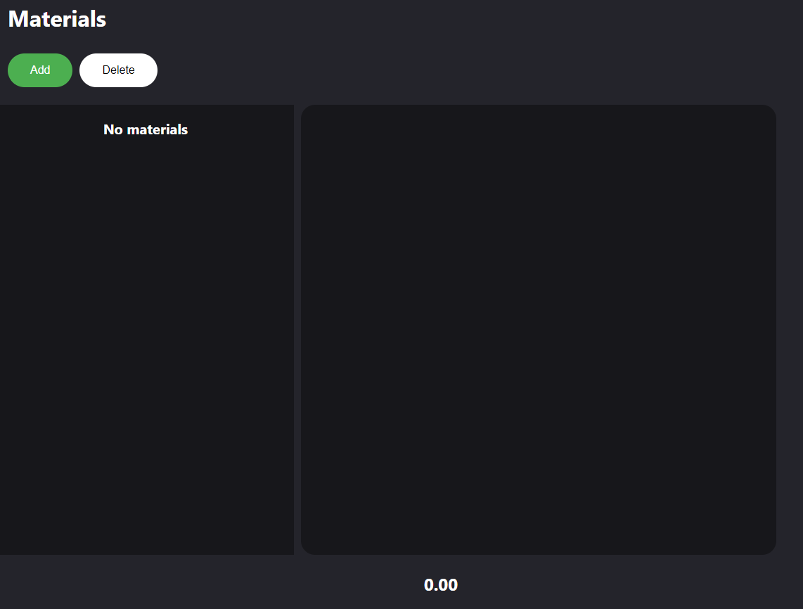
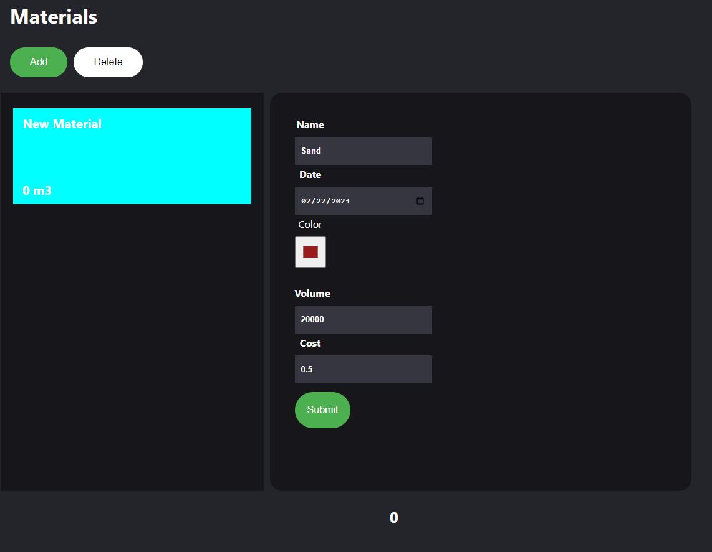
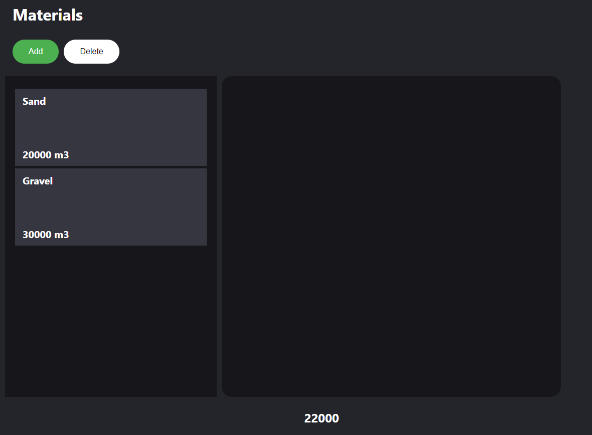

# Welcome to Cesium Material Project!

This app focuses on developing frontend for the application shown in https://www.sketch.com/s/a9a17aad-9171-4b63-a0aa-3b723159f27a.

1. React is used as the Frontend framework for this application.
2. The app uses Firebase for real-time database.
3. It uses axios library which is used to make requests to an API, return data from the API.
4. It uses SCSS for the CSS

# File Structure

The structure of the application is as follows:

1. Assets: contains any images/ other assets required for the applications
2. Components: Contains reusable components such as AddButton and DeleteButton
3. Containers: contains components which in turn requires multiple components. This would allow the developer to easily distinguish this folder from components folder.
4. HOC: higher order component folder contains the component that will be connected with App component.

## Running the application

1.  Clone this repository onto your local machine.
2.  Install the necessary dependencies such as axios,
3.  Start the development server by running `npm start` in your terminal.

## Application

The application itself is divided into 3 main components

1. Single Material: This component will display name, volume, cost and date of the current material. These details can be changed by the user
2. Material List: This component displays list of all the materials that exist in the database and the new entry if created by the user
3. Add and Delete Button: These buttons allow the user to create or delete an entry in the database.
4. Materials: This component encompasses Single Material and Material List component. In this material, items from the DB are fetched to pass it onto the other components as props.

CSS files for each component are created inside the specific component folder.

### Notes

1. Clicking on the add button does create an entry but I did not want to keep sending request to the DB so created a submit button for single entry. Add Button creates an entry in the frontend but submit creates an entry in the DB
2. New Material details are not taken into account until their entry is created in the DB. I was not completely sure about the user requirement in this case.
3. The best option would have been to store all the states using Redux.(Was too far into the project to make these changes due to time constraint)

### Project Timeline

I spend roughly 3.5 hours on the project.

20-30 mins - Planning the components and deciding on the DB(DB was taken based on convienence as I had some experience working on Firebase)

30-40 mins - Working on the Single Material Container

15-20 mins - Working on the Material List Container

50 mins - Working on Materials Container(Connection with Firebase included)

30-35 mins - Working on CSS of all the components and containers

30 mins - Working on Add and Delete Button Functionality

30-45 mins - Fixing bugs and starting with unit tests.

### Further Additions and Improvements

Following are the items that needs to be added in the project

1. Testing of the components using jest and react-testing-framework. Added one test but did not have time for further changes.
2. Edit Button to the Single Material Component
3. CSS changes the project
4. Although color information is stored in the DB, it is not displayed in the frontend. Need to fix this bug
5. Convert it into an application using `electron`

### Sample images of the project

